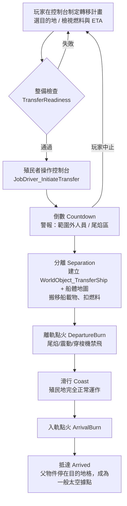
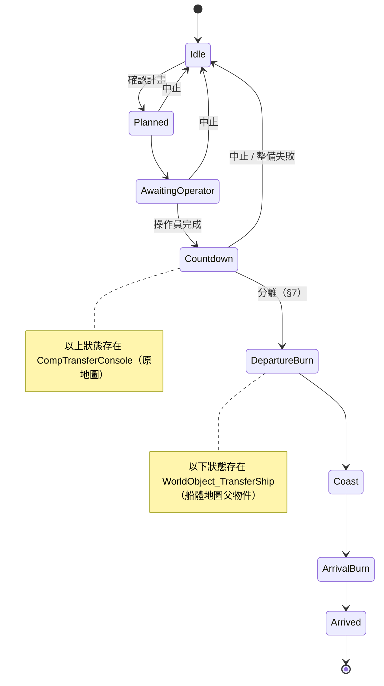

# DMSE 轉移飛行重構 — 實作流程與細節

> 狀態：**設計稿（尚未實作）**　｜　撰寫：2026-10-10　｜　依據：`.source/DMSE/CelestialTransfer` 現行程式碼 + RimWorld 1.6 / Odyssey 原版原始碼
>
> 本文是重構的實作藍圖：先盤點現況，再逐項定義新系統的 Def、Comp、演算法、狀態機與分期驗收方式。數值皆為**建議初值**，集中在一個 Tuning Def 便於後續平衡。

---

## 0. 需求對照總表

| # | 需求 | 設計要點 | 主要類別 / Def |
|---|---|---|---|
| 1 | 不再依附逆重船，獨立控制台 | 新建築「轉移飛行控制台」；完全不碰 `Building_GravEngine` / `CompPilotConsole`，移除駕駛台攔截 patch | `DMSE_TransferConsole`、`CompTransferConsole`、`ITab_TransferShip` |
| 2 | 3×3 結構樁界定飛行範圍；需連結成一體 | 每根樁覆蓋一個方形範圍；覆蓋範圍**相接或重疊**即連結；同一連通分量＝一艘船；範圍內非虛空的地板與其上物件＝船體 | `DMSE_StructuralPile`、`CompStructuralPile`、`MapComponent_PileNetwork`、`ShipFootprint` |
| 3 | 燃料 ∝ 連結的樁數；地板下渲染鋼樑 | 燃料公式對樁數（權重和）線性；`SectionLayer` 於 `AltitudeLayer.BelowTerrain` 依連結（最小生成樹）畫鋼樑 | `TransferFlightMath`、`SectionLayer_StructuralBeams` |
| 4 | 只在起終點點火加減速；飛行中殖民地正常運作（含穿梭機起降） | 起飛時把船體「分離」成獨立的船體地圖，掛在會移動的 `SpaceMapParent` 子類上；狀態機：倒數 → 分離 → 離軌點火 → 滑行 → 入軌點火 → 抵達；只有點火階段有推力效果 | `WorldObject_TransferShip`、`ShipSeparationUtility`、`TransferPhase` |
| 5 | 前期化學燃料引擎 | 新增 `DMSE_ChemicalTransferEngine`：中推力、燃耗基準 1.0、前期研究即可建造 | `CompTransferEngine` |
| 6 | 熱核推進器改低燃耗大推力 | `DMSE_NuclearThruster` 改掛 `CompTransferEngine`：高推力、燃耗倍率 0.35；需核融合爐支援 | 同上 + `DMSE_FusionCore` 角色調整 |

---

## 1. 現況盤點（將被取代的部分）

### 1-1. 現行流程

```
駕駛台 StartChoosingDestination_NewTemp
  └─ Patch_CompPilotConsole_StartChoosingDestination（VGE 存在時改由 Patch_VGE_StartChoosingDestination_Interceptor）
       └─ Dialog_SelectFlightMode（Standard / Transfer / Impact）
            └─ FlightModeLauncher.StartTransferOrImpact → TilePicker（半徑 = MaxDistForFuel）
                 └─ DoLaunch：ConsumeFuel → 建立 WorldObject_Transfer / WorldObject_ImpactGravship
                      └─ MapComponent_Ship：WarmUp（5 秒真實時間）→ Working（全程點火）
                           └─ TravelingObject.Arrive：把「整張地圖」的 MapParent.Tile 改成目的地
```

### 1-2. 與逆重船的耦合點（全部要拆掉）

| 耦合 | 位置 |
|---|---|
| 必須有 `Building_GravEngine`，且連結 `DMSE_FusionCore` ×1、`DMSE_TransferThruster` ×2 以上 | `FlightUtility.GetFailReason` / `CanTransfer` |
| 燃料讀 `engine.TotalFuel`、扣燃料走 `engine.GravshipComponents` | `FlightUtility.ConsumeFuel`、`VGEFuelHandler.ConsumeFuel` |
| 入口是 patch 駕駛台，VGE 時還要清 VGE 內部 static state 防劫持 | `Patch_CompPilotConsole_StartChoosingDestination`、`Patch_VGE_StartChoosingDestination_Interceptor.ClearVGEState` |
| 推進器以 `CompGravshipThruster` + `GravshipComponentTypeDef DMSE_TransferThruster` 識別 | `DMSE_Gravship.xml`、`Patches.xml`（GravEngine linkableFacilities） |
| 建築繼承 `GravshipComponentBase` → `terrainAffordanceNeeded = Substructure`，只能蓋在逆重船底板上 | `DMSE_Gravship.xml` |

### 1-3. 現行行為中不沿用的部分

- **整張地圖搬家**：無法只帶走一部分（例如小行星上的一角基地），也就無法實現需求 2。
- **全程點火**：`MapComponent_Ship.TickWorking` 每 tick 搖鏡頭、每 tick 以 O(pawn × 推進器) 檢查汽化；需求 4 要求只在起終點點火。
- `TravelingObject.isTraveling` 未存檔，讀檔後靠 `MapComponent_Ship.FinalizeInit` 重新 `Init` 才恢復；`thrusterPlacements` 也未存檔（靠重抓 GravEngine）。新設計把飛行狀態完整存在 WorldObject 上，不再依賴重建。
- `Patch_Visible.WO` 是 static List，新遊戲/讀檔時不會清空。
- `WorldObject_ImpactGravship.Arrive` 用 `.First()` 找地圖、`engine.LabelCap` 未判空，移植時一併修正（見 §9）。

---

## 2. 新架構總覽

### 2-1. 名詞

| 名詞 | 定義 |
|---|---|
| 結構樁（Structural Pile） | 3×3 建築，提供一個方形「覆蓋範圍」 |
| 結構網路（Pile Network） | 覆蓋範圍相接/重疊的樁所構成的連通分量；**一個網路＝一艘可移動的船** |
| 船體範圍（Footprint） | 網路覆蓋範圍聯集 ∩ 非虛空地形的格子 |
| 船載物（Manifest） | 完整位於船體範圍內的建築、站在範圍內的 pawn / 物品 / 其他物件 |
| 船體地圖（Ship Map） | 起飛時新建的地圖，船體範圍原座標搬入；飛行期間正常運作 |
| 航行物件 | `WorldObject_TransferShip : SpaceMapParent`，船體地圖的父物件，負責世界地圖上的移動與飛行狀態 |

### 2-2. 核心決策：「分離式船體地圖」

| 方案 | 說明 | 結論 |
|---|---|---|
| A. 整圖搬遷（現行） | 移動原地圖的 MapParent | 無法只帶走部分；留下的部分（其他建築、殖民者）也會被一起帶走或必須銷毀 → **不符需求 2** |
| B. 原版 Gravship 管線 | `GravshipUtility.GenerateGravship` → 飛行 → `GravshipPlacementUtility.PlaceGravshipInMap` | 飛行中船體只是 WorldObject 內的資料，沒有地圖 → **不符需求 4**；且 `Gravship` 建構子強依賴 `Building_GravEngine.ValidSubstructure` |
| **C. 分離式船體地圖（採用）** | 起飛瞬間新建一張同尺寸的太空地圖，把船體範圍**以相同座標**搬過去；新地圖的父物件在世界地圖上移動 | 只帶走範圍內的部分；飛行中是一張真正的玩家地圖，殖民地、穿梭機、事件都照常；抵達時不需再放置 |

方案 C 的關鍵簡化：

1. **同座標搬移**：船體地圖與原地圖同尺寸，所有格子座標不變 → 不需要旋轉/位移換算，Comp 內存的 `IntVec3`、bill、床位、儲存設定都不用改寫。
2. **同步完成、不需存檔快照**：分離在一個 `LongEvent` 內同步完成（擷取 → 移除 → 生成），中途不會存檔，所以不必像原版 `Gravship` 那樣把快照做成 `IExposable`。
3. **抵達即落地**：抵達時船體地圖原地保留，只是父物件停在目的地格 → 不需要落地選位流程。

### 2-3. 總流程



---

## 3. 結構樁與結構網路（需求 2）

### 3-1. 建築 Def：`DMSE_StructuralPile`

```xml
<ThingDef ParentName="BuildingBase">
  <defName>DMSE_StructuralPile</defName>
  <label>structural pile</label>
  <size>(3,3)</size>
  <rotatable>false</rotatable>
  <passability>Impassable</passability>
  <fillPercent>1</fillPercent>
  <holdsRoof>true</holdsRoof>
  <terrainAffordanceNeeded>Heavy</terrainAffordanceNeeded>  <!-- 不要 Substructure：要能蓋在小行星岩地與軌道平台上 -->
  <designationCategory>Odyssey</designationCategory>          <!-- 或 DMSE 自己的分頁 -->
  <researchPrerequisites><li>DMSE_OrbitalDynamics</li></researchPrerequisites>
  <costList><Steel>150</Steel><ComponentIndustrial>2</ComponentIndustrial></costList>
  <placeWorkers><li>DMSE.PlaceWorker_StructuralPile</li></placeWorkers>
  <drawPlaceWorkersWhileSelected>true</drawPlaceWorkersWhileSelected>
  <comps>
    <li Class="DMSE.CompProperties_StructuralPile">
      <coverageRadius>6</coverageRadius>   <!-- 以中心格為準的 Chebyshev 半徑：6 → 13×13 -->
      <massWeight>1</massWeight>           <!-- 燃料/質量權重；標準樁 = 1 -->
    </li>
  </comps>
</ThingDef>
```

`CompProperties_StructuralPile`：

| 欄位 | 預設 | 說明 |
|---|---|---|
| `coverageRadius` | 6 | 方形覆蓋半徑（Chebyshev）。方形比圓形更貼合格狀建造，邊界一目了然 |
| `linkRange` | `-1`（自動 = `2 × coverageRadius + 1`） | 兩樁中心 Chebyshev 距離 ≤ linkRange 即連結。自動值的意義是「覆蓋範圍相接或重疊就連結」，因此**任一格不會同時屬於兩個網路** |
| `massWeight` | 1 | 需求 3 的「樁數」實際上取 Σ massWeight，方便日後做重型/輕型樁變體；標準樁全為 1 時即等於樁數 |
| `beamGraphic` 系列 | — | 鋼樑貼圖（見 §3-7） |

> 不變式：若各樁 `coverageRadius` 不同，連結條件改用「兩樁覆蓋方形相接或重疊」（`|dx| ≤ r1 + r2 + 1` 且 `|dz| ≤ r1 + r2 + 1`），仍維持「格子不跨網路」。

### 3-2. 船體範圍（Footprint）判定

```
Footprint(network):
  covered = ⋃ 每根樁的 CellRect.CenteredOn(pile.Position, r)，裁切到地圖邊界
  footprint = { c ∈ covered | IsSolidCell(c) }

IsSolidCell(c):
  terrainGrid.FoundationAt(c) != null            // 逆重船底板等地基
  || terrainGrid.TerrainAt(c) != TerrainDefOf.Space   // 小行星岩地、軌道平台、各種地板
```

- 真空小行星：Odyssey 小行星地圖的岩地/岩壁（Vacstone 系列地形與 mineable）都不是 `Space`，自然被納入。
- 軌道平台：`DMS_OrbitalPlatform`（及其他 mod 平台地形）同理。
- 範圍內的虛空格不搬（上面也不會有東西，`Space` 地形 `passability = Impassable`）。

### 3-3. 船載物納入規則

| 物件 | 規則 | 備註 |
|---|---|---|
| 建築（含多格） | `OccupiedRect` **每一格**都在 footprint 內才納入 | 跨界建築 → 整備檢查失敗並列出（含「跳轉」按鈕）。對應原版 `engine.OnValidSubstructure(thing)` |
| 附掛建築（`building.isAttachment`） | 跟隨母體 | 原版用 `GenConstruct.GetAttachedBuildings` |
| 天然岩（mineable） | 納入（小行星碎塊一起帶走） | Tuning 可關閉 |
| Pawn / 物品 / 汙物 / 藍圖 / 框架 | `Position` 在 footprint 內即納入 | 搬運中物品先放下到原格 |
| `def.bringAlongOnGravship == false` | 尊重原版旗標，不搬 | 若其位於 footprint 內，分離後會懸在虛空 → 直接 `Destroy(Vanish)`，整備檢查時先警告 |
| `Mote` / `Skyfaller` | 不搬 | 同原版 `Gravship.ShouldBringOnGravship` |
| 地圖入口（`MapPortal`，例：DMSE 真空密封室） | 搬，並把對應 `PocketMapParent.sourceMap` 改指船體地圖 | 否則口袋地圖會在原地圖棄置時被一起銷毀（`Game` 內 `destroyOnParentMapAbandoned`） |

### 3-4. `MapComponent_PileNetwork`

```csharp
public class MapComponent_PileNetwork : MapComponent
{
    private readonly List<CompStructuralPile> piles = new();   // 不存檔，FinalizeInit 時由 listerBuildings 重建
    private List<PileNetwork> networks;                         // 快取
    private bool dirty = true;

    public void Register(CompStructuralPile p)   { piles.Add(p); MarkDirty(); }   // PostSpawnSetup
    public void Deregister(CompStructuralPile p) { piles.Remove(p); MarkDirty(); } // PostDeSpawn
    public void MarkDirty() { dirty = true; map.mapDrawer.WholeMapChanged(DMSE_DefOf.DMSE_StructuralBeams); }  // 重建網路時 footprint 一併失效

    public IReadOnlyList<PileNetwork> Networks { get { if (dirty) Rebuild(); return networks; } }
    public PileNetwork NetworkOf(Thing pile);
    public PileNetwork NetworkAt(IntVec3 c);   // 依 covered 判定
}

public class PileNetwork
{
    public List<CompStructuralPile> Piles;
    public List<(CompStructuralPile a, CompStructuralPile b)> BeamEdges; // 最小生成樹，給渲染用
    public float MassWeight;                    // Σ massWeight（需求 3）
    public HashSet<IntVec3> Covered;            // 覆蓋聯集
    public HashSet<IntVec3> Footprint;          // 懶計算，地形變動時失效
    public CompTransferConsole PrimaryConsole;  // 網路內第一個可用控制台
}
```

- **Rebuild**：樁數 P 通常 < 100，直接 O(P²) 兩兩判斷連結 → 併查集求連通分量 → 每個分量再用 Kruskal 求最小生成樹（MST）作為 `BeamEdges`。連通性與 MST 等價，所以「是否連成一體」就看 MST 是否只有一棵。
- **Footprint 失效**：地形改變（鋪地板、挖礦、拆地基）會改變 footprint。不必即時追蹤；在「被查詢且距上次計算 > 250 tick」或 `TerrainGrid.SetTerrain`/`SetFoundation`/`RemoveFoundation` 的 postfix 中標記 `footprintDirty`（後者只在格子落在某網路的 `Covered` 內時才標記）。起飛時一律強制重算。

### 3-5. 放置與檢視 UI

- `PlaceWorker_StructuralPile.DrawGhost`：
  - 以 `GenDraw.DrawFieldEdges` 畫出預定覆蓋方形。
  - 對 linkRange 內的既有樁以 `GenDraw.DrawLineBetween` 畫預覽連線；若會**合併**兩個網路，用不同顏色提示。
- `AllowsPlacing`：中心 3×3 必須是 solid cell（不能蓋在虛空上）。
- 選取任一樁或控制台時（`CompStructuralPile.PostDrawExtraSelectionOverlays`）：畫出整個網路的 footprint 邊界、所有樁的連線、推進器尾焰區；跨界建築以紅框標示。

### 3-6. 樁被摧毀/拆除時

- 網路即時重算；若船正在**倒數**階段 → 自動中止並發信件。
- **飛行中**（已分離）：船體已是獨立地圖，樁的增減只影響**下一次**轉移，不會讓船在飛行中「解體」。（保持簡單，避免飛行中切割地圖。）

### 3-7. 地板下鋼樑渲染（需求 3 後半）

**原理**：Odyssey 的 `Space` 地形 `dontRender = true`，虛空格看得到背景；`AltitudeLayer.BelowTerrain = 0` 低於所有地形。因此把鋼樑畫在 `BelowTerrain`：
- 有地板的格子 → 被地形蓋住，看不到；
- 虛空格 / 地形邊緣的透明處 → 鋼樑透出，呈現「船體骨架伸出小行星/平台」的效果。

**實作**：`SectionLayer_StructuralBeams : SectionLayer`（原版 `Section` 會以 `typeof(SectionLayer).AllSubclassesNonAbstract()` 自動實例化所有子類，不需註冊）。

```csharp
public class SectionLayer_StructuralBeams : SectionLayer
{
    public SectionLayer_StructuralBeams(Section section) : base(section)
    {
        relevantChangeTypes = (ulong)DMSE_DefOf.DMSE_StructuralBeams;  // 自訂 MapMeshFlagDef
    }

    public override void Regenerate()
    {
        ClearSubMeshes(MeshParts.All);
        var comp = Map.GetComponent<MapComponent_PileNetwork>();
        float alt = AltitudeLayer.BelowTerrain.AltitudeFor();
        CellRect rect = section.CellRect;
        foreach (var net in comp.Networks)
        foreach (var (a, b) in net.BeamEdges)
        {
            Vector3 from = a.parent.TrueCenter(), to = b.parent.TrueCenter();
            float angle = (to - from).AngleFlat();
            // 將線段切成 1 格長的小段；只輸出中點落在本 section 內的段落 → 長樑跨 section 也不會被視錐剔除
            foreach (Vector3 mid in BeamSegmentCenters(from, to))
                if (rect.Contains(mid.ToIntVec3()))
                    Printer_Plane.PrintPlane(this, mid.WithY(alt), BeamSegmentSize, BeamMat, angle);
        }
        // 節點：樁中心畫 Center 貼圖；度數 = 1 的樁在連線方向外側畫 End 端蓋
        FinalizeMesh(MeshParts.All);
    }
}
```

- **渲染邊**：只畫 MST 邊，避免多樁密集時變成蜘蛛網；Tuning 可選「再加畫長度 ≤ 0.6 × linkRange 的冗餘邊」做桁架感。
- **重建時機**：網路變動時 `map.mapDrawer.WholeMapChanged(DMSE_StructuralBeams)`（變動頻率低，整圖重建可接受）。需要新增：

```xml
<MapMeshFlagDef><defName>DMSE_StructuralBeams</defName></MapMeshFlagDef>
```

  `MapMeshFlagDef` 以 `ulong` 位元遮罩實作（`FlagDefUtility.SetMaskFromIndex`，可隱式轉 `ulong`），全遊戲上限 64 個；只新增這一個即可，不要每種效果各開一個。

- **美術**：repo 已有 `Textures/Things/Building/StructuralFrame/{Center,Section,End}`（`building` / `building_top` 兩層，目前用於裝飾建築 `DMSE_StructuralFrame_*`）。初期可直接沿用 `Section` 做樑段、`Center` 做節點、`End` 做端蓋；但這組是帶正面透視的立面圖，地板下的俯視樑建議美術另出一組 **俯視、可無縫平鋪** 的樑段貼圖（建議 64×64 / 每格一段）。
- 任意角度：`Printer_Plane.PrintPlane(layer, center, size, mat, rot)` 支援浮點旋轉，樑段可沿任意方向。若想要純直角桁架風格，可改為 L 形（先 X 後 Z）兩段直線，屬美術選擇。

---

## 4. 轉移飛行控制台（需求 1）

### 4-1. Def 與 Comp

```xml
<ThingDef ParentName="BuildingBase">
  <defName>DMSE_TransferConsole</defName>
  <size>(3,2)</size>
  <hasInteractionCell>true</hasInteractionCell>
  <interactionCellOffset>(0,0,-1)</interactionCellOffset>
  <terrainAffordanceNeeded>Medium</terrainAffordanceNeeded>
  <researchPrerequisites><li>DMSE_OrbitalDynamics</li></researchPrerequisites>
  <inspectorTabs><li>DMSE.ITab_TransferShip</li></inspectorTabs>
  <comps>
    <li Class="CompProperties_Power"><compClass>CompPowerTrader</compClass><basePowerConsumption>300</basePowerConsumption></li>
    <li Class="CompProperties_Flickable" />
    <li Class="DMSE.CompProperties_TransferConsole">
      <operateTicks>1250</operateTicks>          <!-- 點火程序作業時間 -->
      <countdownTicks>2500</countdownTicks>      <!-- 倒數 1 小時（遊戲內） -->
    </li>
  </comps>
</ThingDef>
```

`CompTransferConsole` 職責：

| 項目 | 內容 |
|---|---|
| 所屬網路 | 必須位於某網路 footprint 內；同網路多台時，`PrimaryConsole` 取第一台可用者，其餘顯示「備援」 |
| 可用條件 | 已生成、通電、Flickable 開啟、未損壞（與 `CompBVRDevice.Active` 同樣的判定組合） |
| 存檔狀態 | `TransferPlan plan`（`IExposable`）、`ConsoleState state`（Idle / Planned / AwaitingOperator / Countdown）、`int countdownEndTick` |
| Gizmo | 「制定轉移計畫」、「中止」（Planned/Countdown）、「顯示船體範圍」切換、Debug：立即分離 / 立即抵達 |
| ITab | 見 §4-3 |

### 4-2. 起飛操作流程

1. **制定計畫**：Gizmo →（相機切世界地圖）`Find.TilePicker.StartTargeting_NewTemp`，沿用現行做法：以 `GenDraw.DrawWorldRadiusRing` 畫最大航程圈，驗證函式見 §6-5。
2. **確認視窗** `Dialog_TransferPlan`（取代 `Dialog_SelectFlightMode`）：顯示樁數/質量、推力、TWR、燃料需求/持有、點火時間、滑行時間、總 ETA、**會被留下的殖民者/動物/建築數量**；Impact 選項放在此視窗的危險區塊（見 §9）。
3. **等待操作員**：計畫確認後 `state = AwaitingOperator`；`WorkGiver_InitiateTransfer`（工作類型建議 `Hauling` 以外的高優先，如 `Intellectual`）派殖民者到互動格執行 `JobDriver_InitiateTransfer`（`operateTicks`，帶進度條）。也可以右鍵強制指派（1.6 的 `FloatMenuOptionProvider`）。
4. **倒數**：作業完成 → `state = Countdown`。倒數期間：
   - `Alert_TransferPawnsOutside`：列出在原地圖、**不在** footprint 內的殖民者/囚犯/動物（左鍵輪流跳轉）。
   - `Alert_TransferExhaustDanger`：列出站在推進器尾焰區的 pawn。
   - 每次 tick 檢查整備狀態，失敗就自動中止（例：樁被拆、燃料被搬走）。
5. **分離**：倒數結束 → §7。

### 4-3. `ITab_TransferShip` 內容

- 網路：樁數 / massWeight 合計 / footprint 格數 / 是否有跨界建築（可點擊跳轉）。
- 推進：引擎清單（類型、推力、狀態：可用/尾焰受阻/無核融合爐支援/斷電/損壞）、總推力、TWR（低於門檻紅字）。
- 燃料：燃料來源清單與總量、目前計畫需求、以現有燃料可達的最大距離。
- 飛行中（控制台已在船體地圖上）：目前階段、階段剩餘時間、總進度、目的地、預計抵達日期。

### 4-4. 整備檢查 `TransferReadiness`

回傳 `List<TransferIssue>`（嚴重度 Error / Warning + 文字 + 可選 `GlobalTargetInfo` 跳轉目標）。Error 會擋下起飛：

| 檢查 | 嚴重度 |
|---|---|
| 地圖不在太空層（`map.Tile.LayerDef.isSpace`） | Error |
| 控制台不在任何網路 footprint 內 / 不可用 | Error |
| 無可用引擎，或 TWR < `minTWR` | Error |
| 燃料 < 計畫需求 | Error |
| 存在跨界建築 | Error |
| 已有另一艘船正從此地圖起飛（同一地圖同時只允許一個倒數中的計畫） | Error |
| 範圍外有殖民者 / 囚犯 / 動物 | Warning |
| footprint 內有 `bringAlongOnGravship = false` 的物件 | Warning |
| pawn 站在尾焰區 | Warning |

---

## 5. 推進器、燃料與數值模型（需求 3、5、6）

### 5-1. `CompTransferEngine`

不再繼承 `CompGravshipThruster`（它是 `CompGravshipFacility`，會去找 GravEngine 連結）。自訂 `CompProperties_TransferEngine`：

| 欄位 | 說明 |
|---|---|
| `thrust` | 推力（抽象單位） |
| `fuelFactor` | 燃耗倍率（1.0 = 化學推進基準；越低越省） |
| `requiresReactorSupport` | 是否需要網路內有可用的核融合爐（熱核推進器用） |
| `exclusionAreaSize` / `exclusionAreaOffset` | 尾焰區，語意同原版 `CompProperties_GravshipThruster` |
| `flameSize` / `flameOffsetsPerDirection` / `flameShaderType` / `flameShaderParameters` | 火焰外觀，欄位名與原版相同，方便直接搬 XML |
| `exhaustSettings` | 直接沿用原版型別 `CompProperties_GravshipThruster.ExhaustSettings`（public 巢狀類別） |

**可用判定 `IsOperational`**：已生成、位於某網路 footprint 內、未損壞、Flickable 開啟、通電（若有 PowerTrader）、尾焰區未受阻、（`requiresReactorSupport` 時）網路內核融合爐支援額度足夠。

**尾焰受阻** `IsExhaustBlocked`：參考原版 static `CompGravshipThruster.IsBlocked(...)` 的寫法自行實作（原版版本會讀 `CompProperties_GravshipThruster` 且有 substructure 規則，無法直接呼叫）。規則：尾焰區內有 `passability = Impassable` 或 `fillPercent ≥ 0.5` 的建築（含天然岩）即受阻。地板本身不擋，但點火時會燒傷其上的 pawn/物品（§6-3）。

**放置**：`PlaceWorker_TransferEngine` 畫出尾焰區並即時顯示是否受阻。

**火焰繪製**：改由 `CompTransferEngine.PostDraw()` 在「所屬船正處於點火階段」時繪製（邏輯從現行 `MapComponent_Ship.Draw` 搬過來），不再由 MapComponent 統一畫；狀態由 `map.Parent as WorldObject_TransferShip` 查詢，Comp 本身不需存檔。

### 5-2. 燃料來源

燃料來源 = 船體 footprint 內符合下列任一條件、且 `CompRefuelable` 燃料過濾允許化學燃料的建築：

1. 有 `CompGravshipFacility` 且 `Props.providesFuel = true`（原版小/大化學燃料槽、`DMSE_FuelSiloTank`）——不需要連到 GravEngine，只看旗標；
2. 掛有 DefModExtension `DMSE.TransferFuelSourceExtension`（給其他 mod 的燃料槽用 XML 接入）。

以介面抽象，方便 VGE：

```csharp
public interface ITransferFuelSource { float Available { get; } void Draw(float amount); Thing Parent { get; } }
// 內建：RefuelableFuelSource（CompRefuelable）
// VGE 專案註冊：PipeResourceFuelSource（反射 PipeSystem.CompResourceStorage.AmountStored / DrawResource，沿用 VGEFuelHandler 的作法）
public static class TransferFuelSources { public static void RegisterProvider(Func<Thing, ITransferFuelSource> p); }
```

扣燃料：依各來源存量**等比例**扣（沿用現行 `comp.ConsumeFuel(comp.Fuel * ratio)` 的精神）。

### 5-3. 數值模型

符號：

| 符號 | 定義 |
|---|---|
| `W` | 網路的 Σ massWeight（標準樁 = 樁數） |
| `T` | Σ 可用引擎 `thrust` |
| `TWR` | `T / W` |
| `η` | 推力加權燃耗倍率 = Σ(thrustᵢ × fuelFactorᵢ) / T |
| `d` | 起點到終點的 `Find.WorldGrid.TraversalDistanceBetween`（軌道層格數） |

公式（常數見 §5-6）：

```
燃料需求   F      = W × (B + P × d) × η                     ← 對樁數線性（需求 3）
最大航程   d_max  = floor( (Fuel / (W × η) − B) / P )         ← 畫航程圈用
起飛門檻   TWR ≥ minTWR
單次點火時間 t_burn = clamp( burnHoursRef × TWRref / TWR , minBurnHours , maxBurnHours )   ← 推力越大點火越短
滑行時間   t_coast = d × coastHoursPerTile
總時間     t_total = 2 × t_burn + t_coast
```

設計意圖：

- **燃料 ∝ 樁數**：船越大越耗油，與用了哪種引擎無關；引擎只透過 `η` 影響「每根樁」的成本。
- **推力 = 能不能飛、點火多久**：TWR 不足不能起飛；推力大 → 點火階段短（點火期間有尾焰危險、震動、穿梭機禁飛），所以大推力在玩法上是實利。
- 與距離相關的項 `P × d` 保留「航程圈」的直覺 UI。物理上可解釋為：距離越遠選用能量越高的轉移軌道。
- 選用：控制台可加「轉移剖面」滑桿（經濟 ↔ 快速），以倍率 s 調整 `P × s`（燃料）與 `t_coast / s`（時間），列為後期功能。

### 5-4. 試算（以 §5-6 初值：B = 60、P = 12、chem η = 1.0、NTR η = 0.35、化學推力 3、熱核推力 12、minTWR 0.5、burnHoursRef 3h @ TWRref 1、coastHoursPerTile 2）

| 船 | 引擎 | W | T / TWR | d | 燃料 F | 單次點火 | 滑行 | 總時間 |
|---|---|---|---|---|---|---|---|---|
| 前期小船 | 化學 ×2 | 4 | 6 / 1.5 | 5 | 4×(60+60)×1.0 = **480** | 2 h | 10 h | 14 h |
| 前期小船 | 化學 ×2 | 4 | 6 / 1.5 | 20 | 4×(60+240) = **1200** | 2 h | 40 h | 44 h |
| 中型船 | 化學 ×4 | 12 | 12 / 1.0 | 10 | 12×180 = **2160** | 3 h | 20 h | 26 h |
| 中型船 | 熱核 ×1 | 12 | 12 / 1.0 | 10 | 12×180×0.35 = **756** | 3 h | 20 h | 26 h |
| 大型船 | 熱核 ×3 | 30 | 36 / 1.2 | 20 | 30×300×0.35 = **3150** | 2.5 h | 40 h | 45 h |
| 大型船 | 化學 ×10 | 30 | 30 / 1.0 | 20 | 30×300 = **9000** | 3 h | 40 h | 46 h |

參考：現行實作 `FuelConsumePerTile = 100` 並經 `GravshipUtility.TryGetPathFuelCost` 乘上軌道層 `rangeDistanceFactor = 20`，等於**每格 2000 燃料**、與船大小無關；新模型對小船明顯友善、對大船則逼玩家升級熱核。

### 5-5. 引擎與相關建築調整

**(a) 新增：化學轉移引擎 `DMSE_ChemicalTransferEngine`（需求 5）**

| 項目 | 建議 |
|---|---|
| 尺寸 | 2×3（可旋轉；尾焰朝背面） |
| 研究 | `DMSE_OrbitalDynamics`（DMSE 太空線第一個研究，前置僅 `DMS_MechBasis`） |
| 成本 | Steel 180、ComponentIndustrial 4、Chemfuel 50 |
| `thrust` / `fuelFactor` | 3 / 1.0 |
| 尾焰區 | (2, 0, 6)，offset (0, 0, -6) |
| 電力 | 無（或 100W 點火泵），不需核融合爐 |
| 地形 | `Heavy`（不需 Substructure） |
| 外觀 | 可先借原版 `Things/Building/LateralThruster` / `LargeThruster_Burn` 火焰，之後換 DMSE 美術 |

**(b) 改造：熱核推進器 `DMSE_NuclearThruster`（需求 6）**

```diff
- <ThingDef ParentName="ThrusterBase">                      <!-- 原版逆重船推進器基底，要求 Substructure -->
+ <ThingDef ParentName="DMSE_TransferEngineBase">           <!-- 新抽象基底：Heavy 地形、可旋轉、Impassable -->
    <defName>DMSE_NuclearThruster</defName>
    ...
-   <li Class="CompProperties_GravshipThruster">
-     <statOffsets><GravshipRange>30</GravshipRange></statOffsets>
-     <fuelSavingsPercent>-0.5</fuelSavingsPercent>          <!-- 現行：多耗 50% 燃料 -->
-     <componentTypeDef>DMSE_TransferThruster</componentTypeDef>
+   <li Class="DMSE.CompProperties_TransferEngine">
+     <thrust>12</thrust>                                    <!-- 化學引擎的 4 倍 -->
+     <fuelFactor>0.35</fuelFactor>                          <!-- 低燃耗 -->
+     <requiresReactorSupport>true</requiresReactorSupport>
      <exclusionAreaSize>(5, 0, 11)</exclusionAreaSize>      <!-- 以下外觀欄位原樣保留 -->
      <exclusionAreaOffset>(-2, 0, -13)</exclusionAreaOffset>
      <flameSize>15.0</flameSize>
      ...
```

同時從 `Patches.xml`（GravEngine `linkableFacilities`）與 `Patch_VGE.xml`（Gravhulk `linkableFacilities`）移除 `DMSE_NuclearThruster`。

**(c) 核融合爐 `DMSE_FusionCore` 角色**

- 保留 10000W 發電；新增 `CompProperties_TransferReactor { supportedEngines = 2 }`：每座可支援 2 具 `requiresReactorSupport` 引擎（對應描述「預熱核熱推進系統」）。
- 改掛新基底以去除 `Substructure` 地形需求。是否保留逆重船 facility 身分（`CompProperties_GravshipFacility`）由團隊決定；新系統不依賴它。

**(d) 化學燃料筒倉 `DMSE_FuelSiloTank`**

- 保留現狀（同時是逆重船燃料槽），自動成為轉移燃料來源（§5-2 條件 1）。
- 建議改繼承不要求 Substructure 的基底，才能放在小行星岩地上；若仍要做為逆重船燃料槽則需要 Substructure ——兩者擇一，或分成兩個 Def。

**(e) 固體火箭助推器（選用）**：可另掛 `CompTransferEngine`（高推力、燃料自帶、離軌點火後消耗銷毀），作為前期大船的一次性 TWR 補強。

### 5-6. Tuning Def

所有常數集中在單一 Def，避免散落在程式碼：

```xml
<DMSE.TransferFlightTuningDef>
  <defName>DMSE_TransferFlightTuning</defName>
  <fuelBasePerWeight>60</fuelBasePerWeight>         <!-- B -->
  <fuelPerTilePerWeight>12</fuelPerTilePerWeight>   <!-- P -->
  <minTWR>0.5</minTWR>
  <burnHoursRef>3</burnHoursRef>
  <twrRef>1</twrRef>
  <minBurnHours>1</minBurnHours>
  <maxBurnHours>12</maxBurnHours>
  <coastHoursPerTile>2</coastHoursPerTile>
  <exhaustDamageIntervalTicks>60</exhaustDamageIntervalTicks>
  <carryNaturalRock>true</carryNaturalRock>
  <drawRedundantBeams>false</drawRedundantBeams>
</DMSE.TransferFlightTuningDef>
```

由 `DMSE_DefOf.DMSE_TransferFlightTuning` 取用。

---

## 6. 飛行狀態機與世界物件（需求 4）

### 6-1. 階段



| 階段 | 效果 |
|---|---|
| DepartureBurn / ArrivalBurn | 引擎火焰與排氣 fleck、低頻鏡頭震動（僅在檢視船體地圖時）、點火音效、尾焰區傷害、**穿梭機禁止起飛**、世界地圖圖示加尾焰 |
| Coast | 無任何飛行副作用；殖民地、穿梭機、事件完全照常 |
| Arrived | 父物件停在目的地；控制台回到 Idle，可規劃下一次轉移 |

### 6-2. `WorldObject_TransferShip : SpaceMapParent`

繼承 `SpaceMapParent`（原版軌道上「空地」用的 MapParent）：本身就有地圖、可當玩家據點、可收穿梭機選單（`GetShuttleFloatMenuOptions` 已包含 `TransportersArrivalAction_VisitSpace`）。

```csharp
public class WorldObject_TransferShip : SpaceMapParent
{
    // ── 存檔 ──
    public TransferPhase phase;
    public PlanetTile origin, destination;
    public List<PlanetTile> path;            // 起點→終點的格子路徑（§6-4）
    public int departTick, burnTicks, coastTicks;
    public float fuelSpent;
    public bool isImpact;

    public bool InFlight => phase is TransferPhase.DepartureBurn or TransferPhase.Coast or TransferPhase.ArrivalBurn;
    public bool IsBurning => phase is TransferPhase.DepartureBurn or TransferPhase.ArrivalBurn;

    public override Vector3 DrawPos => InFlight
        ? Vector3.Slerp(TileCenter(origin), TileCenter(destination), TransferFlightMath.Progress(this, TicksGame))
        : base.DrawPos;

    protected override void TickInterval(int delta) { base.TickInterval(delta); AdvancePhase(); StepTileAlongPath(); }
    public override bool ShouldRemoveMapNow(out bool alsoRemoveWorldObject)
    { if (InFlight) { alsoRemoveWorldObject = false; return false; } return base.ShouldRemoveMapNow(out alsoRemoveWorldObject); }
    // GetGizmos：飛行中隱藏放棄類指令；加「跳至船體地圖」
    // GetInspectString：階段、剩餘時間、目的地、ETA
    // ExpandingIconRotation：朝向目的地
}
```

`WorldObjectDef`：

```xml
<WorldObjectDef ParentName="SpaceBase">
  <defName>DMSE_TransferShip</defName>
  <label>transfer ship</label>
  <worldObjectClass>DMSE.WorldObject_TransferShip</worldObjectClass>
  <canBePlayerHome>true</canBePlayerHome>          <!-- Map.IsPlayerHome 需要 -->
  <useDynamicDrawer>true</useDynamicDrawer>          <!-- DrawPos 每幀變動 -->
  <expandingIcon>true</expandingIcon>
  <expandingIconTexture>World/WorldObjects/Expanding/Gravship</expandingIconTexture>
  <expandingIconDrawSize>1.35</expandingIconDrawSize>
  <fullyExpandedInSpace>true</fullyExpandedInSpace>
  <mapGenerator>DMSE_ShipVoid</mapGenerator>
  <neverMultiSelect>true</neverMultiSelect>
  <inspectorTabs><li>WITab_Planet</li><li>WITab_Orbit</li></inspectorTabs>
</WorldObjectDef>

<!-- 只鋪虛空：原版 Space 生成器含 ScenParts 與 FogSpace，前者不需要，後者我們自己從原地圖複製迷霧 -->
<MapGeneratorDef ParentName="SpaceMapGenerator">
  <defName>DMSE_ShipVoid</defName>
  <genSteps Inherit="False"><li>Space</li></genSteps>
</MapGeneratorDef>
```

### 6-3. 進度函數（只在兩端加減速）

梯形速度剖面：加速 `t_a = burnTicks`、等速 `t_c = coastTicks`、減速 `t_d = burnTicks`（入軌點火開始時若推力改變可重算 `t_d`，見下）。巡航速度 `v = 1 / (0.5·t_a + t_c + 0.5·t_d)`（以「總進度 = 1」正規化）。

```
t ∈ [0, t_a)                : p = 0.5 · (v / t_a) · t²
t ∈ [t_a, t_a + t_c)        : p = 0.5·v·t_a + v·(t − t_a)
t ∈ [t_a + t_c, t_total]    : u = t − t_a − t_c;  p = 0.5·v·t_a + v·t_c + v·u − 0.5·(v / t_d)·u²
```

- 世界地圖上的船：起步緩慢 → 等速滑行 → 緩慢靠近終點，視覺上直接呈現「只在兩端點火」。
- **入軌點火開始時**重新計算可用推力：引擎在滑行中被毀 → `t_d` 依新 TWR 拉長（重算 `v` 時保持已走進度連續）；若推力歸零 → 以 `maxBurnHours × 2` 作為姿態推進器慢速減速，並發警告信件。不設計「無法減速而飛過頭」的失敗狀態，避免死局。
- 燃料：v1 在**分離時一次扣足** F（確定性、沒有中途缺油狀態）；點火階段只是表現。分段扣除與缺油應變列為後期選項。

**尾焰傷害**（取代現行每 tick 全 pawn × 全推進器的汽化檢查）：點火期間每 `exhaustDamageIntervalTicks`，對每具運作中引擎的尾焰區格子取 `thingGrid.ThingsListAt`：pawn 受 `Flame`/`Vaporize` 傷害、物品與可燃建築受燒。成本只與尾焰區格數相關。點火前的倒數警報（§4-2）已提示玩家清場。pawn 是否在點火期間自動避開尾焰區：可評估 postfix `PawnUtility.KnownDangerAt(IntVec3, Map, Pawn)`，但它對尋路的實際影響範圍需實測。

### 6-4. 世界地圖格子推進

`MapParent.Tile` 決定穿梭機航程、太陽位置、當地時間等，所以飛行中應隨位置更新（原版 `WorldObject.Tile` setter 已處理 `FastTileFinder` 標髒與 `PositionChanged`，可安全頻繁設定）。

- **路徑**：分離時以貪婪鄰格走訪建立 `path`：從起點開始，反覆以 `Find.WorldGrid.GetTileNeighbors` 取鄰格中與終點球面距離最小者，直到終點。
- **更新**：每 250 tick 依進度 p 找 path 上累積距離最接近的索引，設為 `Tile`。
- **避讓**：若該格 `Find.WorldObjects.AnyMapParentAt(tile)` 已有其他地圖（例如途經小行星據點），保留前一格不前進，避免兩張地圖同格造成 `MapParentAt` / `Find.Maps.Find(m => m.Tile == t)` 類查詢混淆。
- **分離當下**：船的 `Tile` 直接設為 `path[1]`（第一個鄰格），**不與原地圖同格**；`DrawPos` 仍從起點中心開始插值，視覺上看不出跳格。
- **抵達**：`Tile = destination`。若入軌點火開始時目的地已被其他世界物件占用（期間生成了任務點），自動改停最近的空鄰格並發訊息。

### 6-5. 目的地驗證（取代 `FlightUtility.ValidateDestinationTile`）

| 條件 | 規則 |
|---|---|
| 圖層 | 與起點同一太空層（現行即如此；跨層轉移列為未來擴充） |
| 占用 | 目的地格 `!Find.WorldObjects.AnyWorldObjectAt(tile)`；點到被占用格時，提示並提供「停泊於最近空鄰格」 |
| 距離 | `d ≤ d_max`（`DebugSettings.ignoreGravshipRange` 時略過） |
| Impact 模式 | 見 §9 |

> 想去小行星據點/空間站：停泊在其鄰格，再用穿梭機往返（正好利用需求 4 的穿梭機能力）。「直接對接/合併地圖」列為後期功能（§11），可重用 §7 的搬移程式碼並加上原版 `GravshipLandingMarker` 式的落點選擇。

### 6-6. 背景世界畫面

沿用現行 `Patch_Background`（postfix `WorldCameraDriver.ApplyMapPositionToGameObject`）的做法，條件改為 `Find.CurrentMap.Parent is WorldObject_TransferShip ship && ship.InFlight`，以 `ship.DrawPos` 計算相機位置 → 飛行中能看到行星背景平滑移動。`Patch_Visible` / `Patch_Hide` / `Patch_Selectable`（隱藏被包裝的原 MapParent）在新設計中不再需要：船本身就是 MapParent，直接正常顯示。

---

## 7. 分離（Separation）— 核心技術細節

整段包在 `LongEventHandler.QueueLongEvent(..., "DMSE_SeparatingShip", doAsynchronously: false, ...)` 中同步執行。模仿原版 `Gravship` 建構子（擷取）與 `GravshipPlacementUtility.PlaceGravshipInMap`（生成）的順序，但改為「原座標、無旋轉、同步完成」。

### 7-1. 步驟

| # | 步驟 | 對照原版 / 注意事項 |
|---|---|---|
| 1 | 強制重算網路與 footprint；再跑一次 `TransferReadiness`，失敗就中止 | |
| 2 | 建立 `WorldObject_TransferShip`（faction = 玩家、名稱 = 控制台/玩家命名、`Tile = path[1]`），`Find.WorldObjects.Add` | |
| 3 | `MapGenerator.GenerateMap(origin.Size, ship, DMSE_ShipVoid)` 產生同尺寸虛空地圖 | 同尺寸 → 座標恆等 |
| 4 | 擷取地圖層資料（在移除任何東西之前）：zones（儲存區/種植區的格子與 `StorageSettings`）、areas（Home / 允許區 / BuildRoof / NoRoof / SnowOrSandClear / PollutionClear）與各 pawn 的區域指派、storage groups、各格的 foundation / top / under 地形與地形顏色、屋頂、氣體、迷霧、地形類 designation（RemoveFloor / PaintFloor / RemovePaintFloor）、物件類 designation、各房間溫度與真空度、`CompPowerTrader.PowerOn`、`CompPower.connectParent` | 原版的 `MoveableArea` 系列建構子要 `Gravship`，且 `RelativeCells` 會讀 `gravship.Rotation`，**不能傳 null 重用** → 自寫輕量快照（不需 `IExposable`，因為同步完成） |
| 5 | 物件排序 `list.SortByDescending(GravshipUtility.ThingSpawnPriority)` → 全部 `PreSwapMap()` → `DeSpawn(DestroyMode.WillReplace)` | 與 `GravshipUtility.GenerateGravship` 相同。`Thing.PreSwapMap` 設 `BeingTransportedOnGravship = true`，直到步驟 9 的 `PostSwapMap` 才清掉；原版數十處 SpawnSetup/DeSpawn（電力、陷阱、汙物、植物、各種 spawner…）據此略過「首次生成/拆除」副作用。DMSE 自己有生成副作用的 Comp 也要比照檢查此旗標 |
| 6 | Pawn：先 `jobs.StopAll()`、`pather.StopDead()`，搬運物放到原格並加入清單 → `PreSwapMap()` → `DeSpawn(WillReplace)`；記錄 drafted 與倒地/在床狀態 | 原版 `Gravship.AddThing` 對搬運物的處理 |
| 7 | 原地圖清理：footprint 各格清掉 foundation / top / under / temp / color 各層並設為 `TerrainDefOf.Space`（發光地形要先 `glowGrid.DeregisterTerrain`）、移除屋頂與 BuildRoof/NoRoof、清氣體/積雪/沙、移除殘留 designation 與 fleck、`MapMeshDirty`、`pathing.RecalculatePerceivedPathCostAt`；最後 `RoofCollapseCellsFinder.CheckAndRemoveCollpsingRoofs` | 逐行對照 `GravshipUtility.GenerateGravship` 後半段。**不能直接用** `TerrainGrid.RemoveGravshipTerrainUnsafe`：它是把格子還原成 under 層（逆重船起飛後露出原本地面），小行星岩地這種沒有 under 層的格子不會變成虛空 |
| 8 | 船體地圖依序生成：先 `shipMap.regionAndRoomUpdater.Enabled = true` → 地基 → 地形（含顏色）→ 氣體 → zones → 地形 designation → 非 pawn 物件 `GenSpawn.Spawn(thing, pos, shipMap, rot)` → pawn（恢復 drafted；倒地者 `RestUtility.TuckIntoBed`）→ 屋頂 → areas 與 pawn 區域指派 → 物件 designation | 對照 `PlaceGravshipInMap` 的順序（地基先於物件，物件先於 pawn，屋頂最後）。`GenStep_Space` 會把 `regionAndRoomUpdater` 關掉，原版放置逆重船前也會重新開啟 |
| 9 | 收尾：`GravshipUtility.UpdateBillDestinations(shipMap)`（原版 public）、電力 `ConnectToTransmitter` 與 `PowerOn` 還原、全部 `PostSwapMap()`、房間溫度/真空度還原、迷霧逐格複製、`origin.storyState` 複製、`autoSlaughterManager.configs` 複製 | 原版 `ApplyTemperatureVacuumFromBase` 需要 `Gravship` 物件，自寫同等邏輯 |
| 10 | 口袋地圖：對每個被搬走的 `MapPortal`，把 `PocketMapParent.sourceMap` 改指 `shipMap` | DMSE 真空密封室屬此類 |
| 11 | 原地圖去留：若原 MapParent 是 `SpaceMapParent`（臨時據點），交給它自己的 `ShouldRemoveMapNow`；若是玩家 `Settlement` 且已無殖民者與玩家建築 → 發信件並以 `GravshipUtility.AbandonMap` 同等流程棄置；否則保留（玩家得到兩個據點） | |
| 12 | 扣燃料（§5-2）、`ship.phase = DepartureBurn`、`departTick = TicksGame`；相機切到船體地圖 | |

### 7-2. 必測案例（分離矩陣）

儲存區 / 種植區 / 儲存群組（櫃子連動）/ bill 目標倉庫 / 床位與醫療床上的倒地者 / 囚犯與奴隸 / 動物與區域限制 / 徵召中的小人 / 搬運中的物品 / 藍圖與施工框架 / 可安裝物品（Minified）/ 電網（含跨界導線被切斷）/ 電池電量 / 房間溫度與真空 / 迷霧 / 屋頂（含小行星天然岩頂）/ 船上停著原版逆重船（GravEngine + Substructure）/ DMSE BVR 雷達與發射器（`CompBVRDevice` 重新註冊）/ 導彈架與彈藥 / 真空密封室（口袋地圖）/ 跨界建築（應被擋下）/ `bringAlongOnGravship = false` 的物件。

### 7-3. 效能

footprint 上限約 30 樁 × 169 格 ≈ 5000 格，與一艘大型逆重船同級；原版同類流程也是同步完成，可接受。所有 `MapMeshDirty` 以 `regenAdjacentSections: false` 呼叫，最後統一重建。

---

## 8. 穿梭機整合（需求 4「含起飛與降落穿梭機」）

| 情境 | 處理 | Hook |
|---|---|---|
| 從飛行中的船起飛 | 照常；航程以船的**當前** `Tile` 計算（§6-4 會持續更新） | 不需 patch |
| 點火階段起飛 | 禁止：回傳 `"DMSE.Transfer.ShuttleBlockedBurn"` | postfix `CompLaunchable.CanLaunch(float?)`（virtual，回傳 `AcceptanceReport`） |
| 從其他地圖飛往移動中的船 | 選單由 `SpaceMapParent.GetShuttleFloatMenuOptions` 提供，不需 patch | — |
| 飛往移動中的船的穿梭機抵達 | 原版 `TransportersArrivalAction_LandInSpecificCell.StillValid` 會檢查 `mapParent.Tile != destinationTile` → 船移動後判定失效；`TravellingTransporters.Arrived` 的退路也是比對 `maps[i].Tile == destinationTile` | prefix `TravellingTransporters.TickInterval`：若 `arrivalAction` 指向的 `mapParent` 是飛行中的 `WorldObject_TransferShip`，每次把 `destinationTile` 同步為 `ship.Tile`（追蹤導航）。落點格 `cell` 屬船體地圖座標，船移動不影響 |
| 點火階段有穿梭機抵達 | v1 允許降落（避免無限盤旋）；之後可改為延後到 Coast | 同上 prefix 可加延後邏輯 |

---

## 9. 撞擊飛行（Hellfire）移植

現行 Impact 掛在逆重船駕駛台的模式選單上，重構後改由轉移控制台提供：

- 條件：網路內運作中熱核推進器 ≥ 3（行星殺手結局 ≥ 4，沿用 `WorldObject_ImpactGravship.Arrive` 的門檻）、核融合爐支援足夠、目的地為地表層。
- 流程：同樣經過倒數 → 分離 → 點火，`isImpact = true`；抵達時執行現行 Hellfire 邏輯（`ImpactCraterUtility.ApplyImpactCraterAtTile`、移除 DMS 軍隊據點、全派系敵對、片尾），最後銷毀船體地圖與 `WorldObject_TransferShip`。
- `WorldObject_ImpactGravship` 的 fade-out 計時（`ScreenFadeSeconds`）邏輯搬進 `WorldObject_TransferShip`（`isImpact` 分支）。
- 順手修正：`Find.Maps.Where(...).First()` 改 `FirstOrDefault`、`engine.LabelCap` 改用船名（新系統沒有 engine）、引擎計數改用 `CompTransferEngine`。

---

## 10. 移除、相容與存檔遷移

### 10-1. 檔案異動清單

| 動作 | 檔案 |
|---|---|
| 刪除 | `Patch_CompPilotConsole_StartChoosingDestination.cs`、`FlightModeLauncher.cs`、`Dialog_SelectFlightMode.cs`、`Patch_CompGravshipFacility_CanBeActive.cs`（已全註解）、`ThingComp_Ship.cs`（空殼）、`ITravelingShip.cs`、`Patch_Visible.cs` |
| 改寫 | `FlightUtility.cs` → `TransferFlightMath.cs` + `TransferReadiness.cs`；`Patch_Background.cs`（改認 `WorldObject_TransferShip`）；`VGECompatibility.cs` → 燃料來源 provider 註冊；`WorldObject_ImpactGravship.cs` → 併入 `WorldObject_TransferShip` |
| 移入 `CelestialTransfer/Legacy/` | `WorldObject_Transfer.cs`、`MapComponent_Ship.cs`（僅供舊檔載入，見 10-2） |
| 新增（C#） | `CompStructuralPile.cs`、`MapComponent_PileNetwork.cs`、`PileNetwork.cs`、`PlaceWorker_StructuralPile.cs`、`SectionLayer_StructuralBeams.cs`、`CompTransferConsole.cs`、`TransferPlan.cs`、`ITab_TransferShip.cs`、`Dialog_TransferPlan.cs`、`JobDriver_InitiateTransfer.cs`、`WorkGiver_InitiateTransfer.cs`、`Alerts_Transfer.cs`、`CompTransferEngine.cs`、`PlaceWorker_TransferEngine.cs`、`CompTransferReactor.cs`、`TransferFuelSources.cs`、`TransferFlightTuningDef.cs`、`WorldObject_TransferShip.cs`、`ShipSeparationUtility.cs`、`Patch_CompLaunchable_CanLaunch.cs`、`Patch_TravellingTransporters_Homing.cs`、`DebugActions_Transfer.cs` |
| 新增（XML） | `ThingDefs_Buildings/DMSE_TransferFlight.xml`（樁、控制台、化學引擎、`DMSE_TransferEngineBase`）、`DMSE_TransferFlightTuning.xml`、`MapMeshFlagDef`、`JobDef`/`WorkGiverDef`、`WorldObjectDef DMSE_TransferShip`、`MapGeneratorDef DMSE_ShipVoid` |
| 修改（XML） | `DMSE_Gravship.xml`（熱核推進器、核融合爐、燃料筒倉）、`Patches.xml`、`GravshipExpanded/Patches/Patch_VGE.xml`、三語系 Keyed / DefInjected |
| 專案檔 | `DMSE.csproj` 為舊式專案、逐檔 `<Compile Include>`，新增/刪除檔案都要同步更新；VGE 專案同理 |
| 文件 | README「4. 天體轉移飛行」段落改寫 |

### 10-2. 舊存檔遷移

- 飛行中的舊檔：保留 `WorldObject_Transfer`、`DMSE_TransferGravShip` Def 與 `MapComponent_Ship` 類別一至兩個版本。`MapComponent_Ship.FinalizeInit` 改為：若 `status != Idle` → 立即呼叫舊 `Arrive()` 讓船瞬間抵達、狀態歸零並記 log。之後版本再刪除（移除 MapComponent 類別會讓舊檔出現 "Could not find class" 錯誤，所以至少保留空殼）。
- `DMSE_TransferThruster` `GravshipComponentTypeDef`：保留 Def 一個版本避免舊檔引用錯誤（無任何建築再使用）。
- 熱核推進器移除 `CompGravshipThruster` 後，舊檔中該 Comp 的存檔節點會被忽略；與 GravEngine 的 facility 連結自動消失。

### 10-3. Vanilla Gravship Expanded

- 刪除 `Patch_VGE_StartChoosingDestination_Interceptor` 與 `ClearVGEState`：新系統不再碰駕駛台，VGE 劫持問題自然消失。
- `VGEFuelHandler` 改寫為 `ITransferFuelSource` provider（讀寫 `PipeSystem.CompResourceStorage`），讓 Astrofuel 筒倉可作為轉移燃料來源。原本對 GravEngine `CompHeatManager` 加熱與 `cooldownCompleteTick` 的處理不再適用（轉移不經過 GravEngine）。
- `Patch_VGE.xml`：從 Gravhulk `linkableFacilities` 移除 `DMSE_NuclearThruster`（及視 §5-5(c) 決定是否移除 `DMSE_FusionCore`）。

### 10-4. 新增翻譯鍵（三語系）

`DMSE.Transfer.*` 前綴：計畫/中止/倒數/各階段名稱、整備檢查各項原因、ITab 欄位、警報（範圍外人員、尾焰危險）、信件（分離完成、抵達、推進器全損減速、原據點棄置）、穿梭機點火禁飛原因、Debug 指令。舊 `DMSE.Flight.*` / `DMSE.Cannot.Reason.*` / `DMSE_ShipWarmUp*` 於遷移期結束後移除。

---

## 11. 分期實作與驗收

| 期 | 內容 | 驗收 |
|---|---|---|
| **P0 基礎** | Tuning Def、DefOf、`DMSE_TransferEngineBase`、Legacy 遷移殼、刪除駕駛台攔截 | 舊檔（含飛行中）可載入且無紅字；逆重船一般跳躍不再彈 DMSE 選單 |
| **P1 結構網路** | 樁 Def/Comp、`MapComponent_PileNetwork`、footprint、PlaceWorker、選取疊加層 | 小行星/軌道平台/逆重船底板上放樁；相接即連結、拆中間樁會分裂成兩網路；footprint 不含虛空；存讀檔後網路一致 |
| **P2 鋼樑** | `SectionLayer_StructuralBeams`、MapMeshFlagDef、貼圖 | 虛空處看得到樑、地板下看不到；網路變動即時更新；樑跨 section 不消失 |
| **P3 控制台與推進** | 控制台、ITab、`TransferReadiness`、`CompTransferEngine`、燃料來源、核融合爐支援、化學引擎、熱核改造、數值公式 | §5-4 試算表數字與 ITab 顯示一致；尾焰受阻/斷電/無核融合爐支援時引擎正確顯示不可用 |
| **P4 分離** | `ShipSeparationUtility` + Debug「立即分離（不飛行）」 | §7-2 矩陣全數通過；分離後立即存讀檔無錯誤 |
| **P5 飛行** | `WorldObject_TransferShip`、狀態機、進度函數、格子推進、點火效果、尾焰傷害、背景 patch、抵達 | 全程可存讀檔、各階段時間符合公式；滑行期殖民地正常（工作、事件、交易船）；抵達後成為一般據點 |
| **P6 穿梭機** | `CanLaunch` 禁飛 patch、追蹤導航 patch | 滑行中從船起飛去其他據點並返回；點火中被擋下；從其他地圖飛往移動中的船可正確降落 |
| **P7 撞擊與 VGE** | Impact 移植、VGE 燃料 provider、XML 清理 | 撞擊流程與結局文本同現行；VGE 環境下 Astrofuel 筒倉可供轉移 |
| **P8 平衡與文案** | 數值調整、三語系、README | — |

Debug 指令（`DebugActions_Transfer`）：顯示 footprint、立即分離、跳到下一階段、立即抵達、加滿網路燃料、列出網路資訊。

---

## 12. 待決事項（建議值供參考）

| # | 問題 | 建議 |
|---|---|---|
| 1 | 樁覆蓋半徑、方形或圓形 | 方形、`r = 6`（13×13），相接即連結 |
| 2 | 範圍內天然岩是否一起帶走 | 帶走（Tuning 開關） |
| 3 | 熱核推進器是否必須有核融合爐 | 是，每座爐支援 2 具 |
| 4 | 燃料何時扣除 | v1 分離時一次扣足；分段扣除與缺油應變列後期 |
| 5 | 點火階段是否禁穿梭機 | 禁止起飛、允許降落 |
| 6 | 起飛是否需要小人操作 | 需要（一次性點火程序），點火期間不需駐守 |
| 7 | 目的地範圍 | v1 只限同層空格；對接既有地圖列後期 |
| 8 | 船體地圖尺寸 | 與原地圖同尺寸（座標恆等）；依 footprint 包圍盒縮小地圖列為記憶體優化 |
| 9 | 核融合爐 / 燃料筒倉是否保留逆重船 facility 身分 | 新系統不依賴；保留與否看是否還要給逆重船用（會牽涉 Substructure 地形需求） |
| 10 | 飛行中當地時間跳動 | `Tile` 移動會改變經度 → 當地時鐘與作息表可能跳 1 小時左右；接受，或於 `GenLocalDate` 相關處固定以起點經度計算（需評估影響面） |
